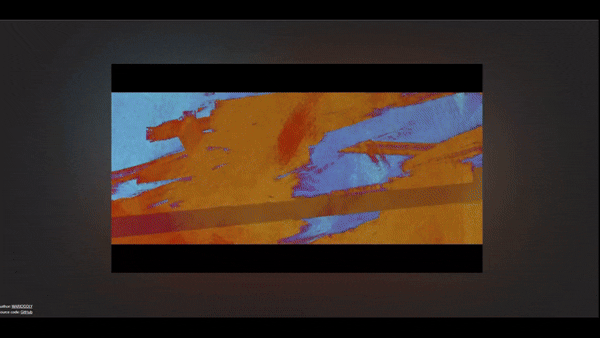

# Luminary

#### Luminary - is a simple class, which adds professional video coverage like on Youtube




### Usage

Example of usage Luminary class:
```typescript
import './style.css'
import Luminary from './Luminary.ts'

document.querySelector<HTMLDivElement>('#app')!.innerHTML = `
  <div style="position: relative">
      <video
            controls
            autoplay
            loop
            muted
            id="app-video"
        >
            <source src="./kyrgyz-warriors.mp4" type="video/mp4">
            Your browser does not support the video tag.
        </video>  
        <div id="app-video-container"></div>
  </div>
`

new Luminary()
```

LuminaryOptions options:
```javascript
const options = {
    container: '#app-video-container',
    video: '#app-video',
    padding: 30,
    background: {
        opacity: 0.7,
        blur: 170,
        duration: 1,
        animation: 'fadeIn'
    }
}
```


### Build the project for production:
```bash
npm run build
```
or development
```bash
npm run dev
```   
for preview
```bash
npm run preview
```
